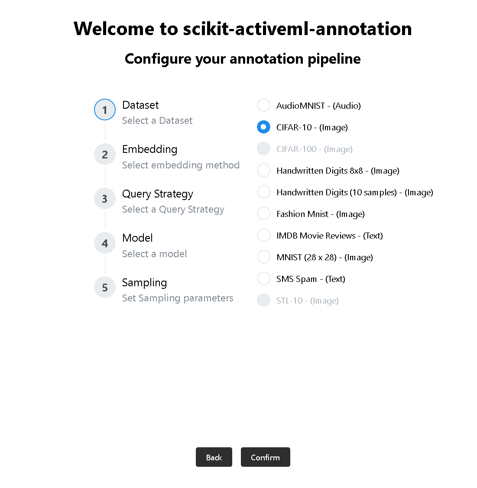
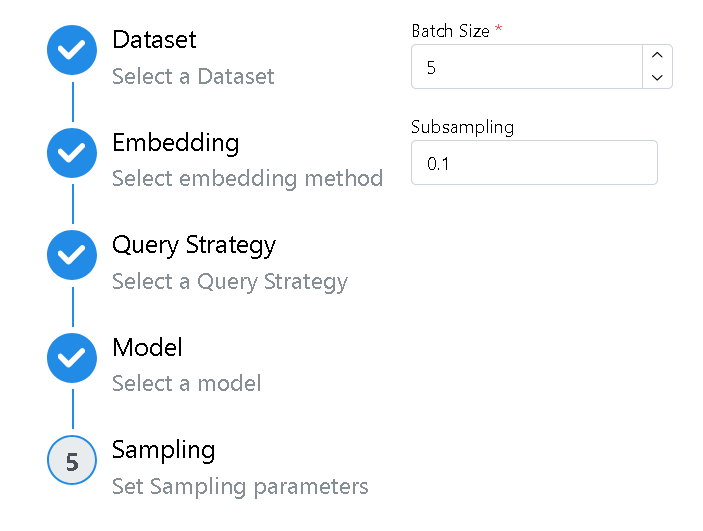
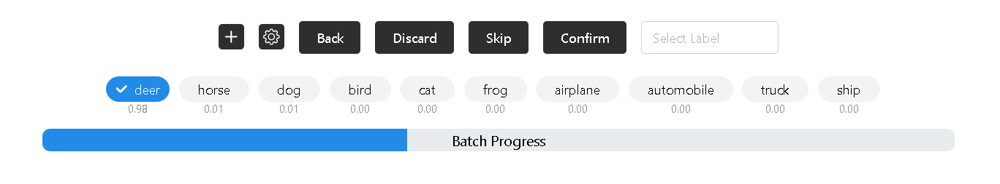
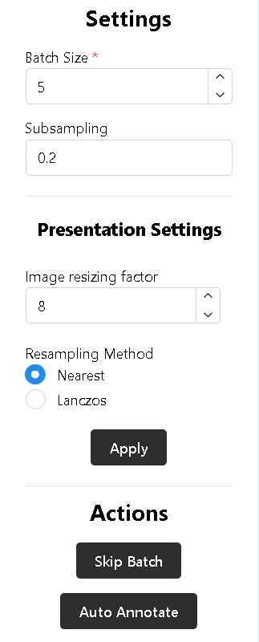

.. _Annotator Guide:

Annotator Guide
---------------
This guide describes the annotation process from the annotator’s perspective.
It explains the user interface across the different pages of the annotation
tool, starting with the Home Page, where the process begins, when the app
is first opened.

.. note::

   This guide assumes the tool has already been set up by an administrator.
   See the :ref:`Admin Guide` for details.

.. contents::
   :local:

.. _Home_Page:

Home Page
~~~~~~~~~~

The home page presents the annotator with a set of preconfigured options
for the active learning pipeline as defined by the admin's ``.yaml``
configuration files.
The annotator selects one option for each of the following steps:

- **Dataset**: The dataset to annotate. If the dataset is not
  installed at the path specified in the corresponding ``.yaml`` configuration
  file, it is displayed in a greyed-out state and is not available for
  selection. When hovering over this dataset the tool displays the path
  where it expects the dataset's sample files to exist.

- **Embedding Method**: The embedding method used to preprocess the previously
  selected dataset. Only embedding methods compatible with the dataset are
  displayed. Compatibility is determined based on the `modality` value in both
  the dataset and embedding ``.yaml`` configuration files.

  Each embedding method displays a status icon: a |checkmark| indicates
  that the selected dataset has already been embedded using that method, while
  a |redcross| signales that this embedding has not yet been computed.

- **Query Strategy**: Determines how samples are selected for annotation,
  by quantifying their informativeness (e.g., `Uncertainty Sampling`
  prioritizes samples for which the model is most uncertain).

- **Model**: The classification model is used by the query strategy to select
  samples for annotation. For model-agnostic strategies (e.g.,
  ``RandomSampling``), the model is only used to display predicted class
  probabilities.

.. _Active_Learning_Parameters:

Active Learning Parameters
^^^^^^^^^^^^^^^^^^^^^^^^^^

This last step allows configuration of the ``Batch Size`` and ``Subsampling``
parameters for the active learning process.

- **Batch Size**: Determines the number of samples queried in each iteration.
  It controls how many samples are to be annotated before the model is refitted
  and new samples are queried.

  .. note::
     At the start of annotation, a small value is recommended, as the model's
     predictions will still change significantly with each new annotation, and
     fitting is computationally inexpensive with only a few samples.

- **Subsampling**: Limits the number of samples considered as candidates for
  querying by only considering a random subset of the pool.
  This reduces computational cost at the expense of possibly not
  selecting the pool's most informative samples.

  An **integer** specifies the maximum number of samples to consider.
  A **float** specifies the fraction of samples to consider.
  If no value is provided, all samples are considered.

  For more detail see:
  `SubSamplingWrapper <https://scikit-activeml.github.io/latest/generated/api/skactiveml.pool.SubSamplingWrapper.html>`_
  ``max_candidates`` parameter.

.. note::
  Upon confirmation of the Active Learning paramters, the page transitions to
  the :ref:`Annotation_Page` if the embedding for the selected dataset has
  already been computed, otherwise, it proceeds to the :ref:`Embedding_Page`.

.. _Annotation_Page:

Annotation Page
~~~~~~~~~~~~~~~

.. figure:: _static/images/annot_image.png
   :alt: Image of the Home page of annotation tool
   :target: _static/images/annot_image.png
   :align: center

The Annotation Page is the main interface for annotating samples.
It computes a batch of samples based on the configuration selected on the
:ref:`Home_Page` and presents the samples one by one for annotation.
Annotation proceeds sequentially. Once all samples in a batch are annotated,
the model is refitted and the next batch is computed, taking into account
the newly labeled data. The functionality is explained below, starting with
the modality-agnostic features.

The main control elements consist of a selection of all classes and
four buttons (``Back``, ``Discard``, ``Skip``, ``Confirm``).
Below each class, the model's predicted class probability
is displayed for the current sample, if supported by the model (that is, if it
implements ``predict_proba``). The predicted class is also preselected.

.. note:: If a sample has been labeled before the previously made annotation
   is preselected instead of the model's prediction.

- **Back**: Moves back by one sample within the current batch. If there is no
  more samples left in the batch, the previous batch is restored.

- **Discard**: Exclude the presented sample from being queried in future
  iterations and move on to the next sample. This can be usefull to mark
  outliers.

- **Skip**: Move on the the next sample without annotating the current one.
  The skipped sample can be queried again in the future.
  Usefull if the annotator is uncertain, for example, when encoutering a
  sample that may belong to a class not that was not shown before.

- **Confirm**: Annotates the presented sample with the currently selected class
  and moves on to the next sample.

On the right side of the buttons, a `Text Input` allows searching for classes.
Exact matches are prioritized, followed by the first prefix match.

On the left side of the buttons, there are two additional controls:

- |add-cls-btn| **Add a new class** using the name currently entered in
  the `Text Input` search field. The new class becomes available for
  future annotations and is automatically assigned to the current sample.
  This is useful if the annotator identifies a new class that is not present
  in the class list defined by the admin.

- |label-settings-btn| **Opens the label settings modal**, which allows
  configuring how classes are presented, including toggling predicted
  class probabilities and controlling the class order.

  .. image:: _static/images/label-settings-modal.png
     :alt: Picture of label setting modal
     :target: _static/images/label-settings-modal.png
     :height: 250px
     :align: center

The progress bar below the class selection, indicates the annotation progress
for the current batch.

Left Sidebar
^^^^^^^^^^^^^

The left sidebar contains ``Batch Size`` and ``Subsampling`` inputs.
These function the same as documented in :ref:`Active_Learning_Parameters`.
They are applied once a new batch is computed.

Below there is the ``Presentation Settings`` which are documented in the
modality-specific section. The ``Apply`` button applies these presentation
settings.

After the presentation settings there is the action buttons:

- ``Skip Batch``: Similar to ``Skip`` but skips all the samples that are
  remaining in the current batch and instantly computes the next batch.

- ``Auto Annotate``: Opens the Auto Annotate modal, where a
  ``Confidence threshold`` can be set. Upon confirmation, all unannotated
  samples are labeled with the class for which the model predicts the greatest
  probability, but only if this probability exceeds the confidence threshold.
  The model is fitted using the existing annotation data before predicting the
  class probabilities for each sample. These annotations will be stored in a
  seperate json file.

  .. warning:: Auto Annotate only works with classifiers that support `predict_proba`

Right Sidebar
^^^^^^^^^^^^^
The right sidebar displays annotations statistics, including the folling values:

- **Annotated**: How many samples have been annotated (not skipped).
- **Total**: Total number of samples in the dataset.

Modality Specific features
^^^^^^^^^^^^^^^^^^^^^^^^^^^
This section describes modality specific features including the ``Display
Settings`` in the left sidebar, which offer controll over how samples of each
modality are presented to the annotator. There is one tab for each modality:

.. tab-set::

  .. tab-item:: Image

    - **Zoom Interaction**: Images can be zoomed in by hovering over the image
      and using the scroll wheel, or by clicking and dragging to define a region
      of interest. Double-clicking resets the view to the original state.

    The following display settings are available for image data:

    - **Image Resizing Factor**: Factor by which the image is rescaled.
    - **Resampling Method**: Controls the resampling filter used by
      `PIL (Pillow) <https://pillow.readthedocs.io/>`_, specifically its
      `resampling filters <https://pillow.readthedocs.io/en/stable/handbook/concepts.html#filters>`_,
      when resizing images. Available options are:

      - ``Nearest``
      - ``Lanczos``
      
    
  .. tab-item:: Text

    The following display settings are available for textual data:

    - **Font Size**: Controls the size of the displayed text.

    - **Line Height**: Controls the vertical spacing between lines of text,
       improving readability.

  .. tab-item:: Audio

    Audio samples are visualized using a log-mel power
    `spectrogram <https://en.wikipedia.org/wiki/Spectrogram>`_,
    which represents the frequency content of the signal over time using
    the
    `mel scale <https://en.wikipedia.org/wiki/Mel_scale>`_.
    The mel scale is a frequency scale designed to reflect human hearing.

    This can help the annotator to identify patterns such as speech, noise, or
    other acoustic events. In addition, a standard audio player is provided
    below the visualization to control the playback of the audio clip.

    The following additional display settings are available for audio data:

    - **Looping**: Controls whether the audio is automatically replayed after
       reaching the end.

    - **Autoplay**: Controls whether the audio is played automatically when
       navigating to a new sample.

    - **Playback Rate**: Controls the speed at which the audio is played
       (as a factor of the original speed).

.. _Embedding_Page:

Embedding Page
~~~~~~~~~~~~~~~

   

This page is shown in case the selected embedding has not yet been computed for
the dataset. The ``Start Embedding`` button allows the annotator to compute
the missing embedding using the admin's ``EmbeddingAdapter`` implementation.
A progress bar indicates the status of the embedding process.
The process can be canceled at any time using the ``Cancel`` button.
Upon completion, the annotator can proceed to the :ref:`Annotation_Page`.

.. _Hotkey_Config_Page:

Hotkey Config Page
~~~~~~~~~~~~~~~~~~

The application provides hotkey support. Most controls described in the
previous sections can alternatively be triggered via keyboard shortcuts.
This page displays the available key bindings with their default configuration
and allows to customize them.

The valid modifier keys are ``Alt``, ``Control``, ``Shift``, and ``Meta``.

